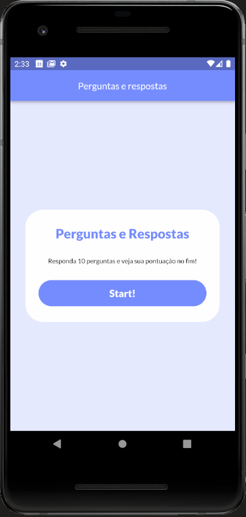

# Desafio da primeira semana do bootcamper usemobile

Até momento a parte visual foi toda produzida, as perguntas foram listada, o resultado está exibindo de forma certa.

O que falta: Quando aperta tenta de novo o estado do app todo reseta para pessoa poder tenta novamente, e criar uma forma de ramdomizar a ordem das perguntas e possiveis resposta.

Quer testa?
tem o desafio1.apk só baixar e instalar no android 
ou 
baixa projeto do flutter e executar
flutter pub get 
flutter run

    

